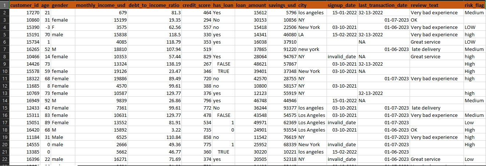
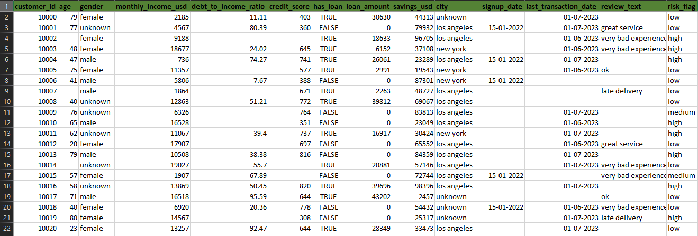

# Real-World Data Cleaning & Validation Pipeline

## 📌 Project Overview
This project demonstrates an **end-to-end data cleaning and validation workflow** using a large, intentionally messy dataset that closely resembles real-world business data.

Unlike typical projects that start with clean datasets, this project focuses on **handling realistic data quality issues** such as missing values, invalid entries, inconsistent formats, duplicates, outliers, and business-rule violations.

The goal is to transform unreliable raw data into an **analysis-ready, trustworthy dataset** using structured reasoning and domain logic.

---

## 🧪 Dataset Creation (Important)
The dataset used in this project was **synthetically generated** with deliberate data quality issues using **ChatGPT**.

It includes:
- Mixed data types
- Invalid and impossible values
- Multiple date formats
- Inconsistent categorical labels
- Duplicate customer records
- Extreme outliers
- Meaningful and non-meaningful missing values

This approach ensures the project reflects **real-world data challenges**, not idealized examples.

---

## 🔍 Raw vs Cleaned Data (Visual Comparison)

To clearly demonstrate the impact of the data cleaning process, below is a visual comparison between the **raw (dirty) dataset** and the **final cleaned & validated dataset**.

### ❌ Raw / Dirty Data (Before Cleaning)
The raw dataset intentionally contains:
- Invalid and impossible values (negative age, ratios > 100)
- Inconsistent categorical values (Yes/No/TRUE/1)
- Multiple date formats and invalid dates
- Duplicate customer records
- Missing and misleading values

---

### ✅ Cleaned & Validated Data (After Cleaning)
After applying structured data cleaning, validation rules, and business logic:
- All columns have correct data types
- Invalid values are removed or corrected
- Missing values are handled intentionally
- One record per customer is retained
- Categorical values are standardized

📌 These screenshots highlight how real-world messy data can be transformed into an **analysis-ready and trustworthy dataset** using systematic data cleaning techniques.

---

## 📊 Dataset Description
**Domain:** Financial / Credit Risk Data  
**Initial Size:** ~50,000 records  
**Final Size:** ~9,800 unique customers  

### Key Features:
- Customer demographics
- Financial attributes (income, debt, savings)
- Credit information
- Loan status
- Transaction dates
- Risk category (target variable)

---

## 🧹 Data Cleaning Phases

### Phase 1: Data Understanding & Profiling
- Explored data structure and distributions
- Identified broken columns and data quality issues
- Distinguished meaningful vs accidental missing values

---

### Phase 2: Data Type Fixing
- Converted numeric, categorical, boolean, and datetime columns
- Safely handled invalid values using coercion
- Standardized mixed representations (Yes/No, 1/0, True/False)

---

### Phase 3: Missing Value Strategy
- Designed column-wise missing value strategies
- Used business logic instead of blanket imputation
- Preserved meaningful missingness where appropriate

---

### Phase 4: Business Rules & Validation
- Enforced real-world constraints (age, income, credit score ranges)
- Applied cross-column rules (loan status vs loan amount)
- Validated date consistency

---

### Phase 5: Duplicate Handling & Record Integrity
- Removed exact duplicate rows
- Resolved multiple records per customer
- Retained the most recent and most complete record per customer

---

### Phase 6: Outlier Detection & Treatment
- Identified outliers using visualization and IQR
- Removed impossible values
- Capped extreme but legitimate financial values
- Preserved meaningful signals

---

### Phase 7: Categorical Cleaning & Final Validation
- Standardized categorical labels
- Cleaned text fields
- Converted categories to optimized data types
- Performed final data quality checks

---

## ✅ Final Outcome
- Clean, validated, and analysis-ready dataset
- One record per customer
- All remaining missing values are intentional and meaningful
- Dataset suitable for EDA, feature engineering, and modeling

---

## 🛠 Tools & Technologies
- Python
- Pandas
- NumPy
- Matplotlib

---

## 🚀 Next Steps
- Exploratory Data Analysis (EDA)
- Feature Engineering
- Machine Learning modeling
- Business insights & visualization

---

## 🎯 Key Takeaway
> Data cleaning is not about removing data — it is about **making data trustworthy**.

This project demonstrates practical, interview-ready data cleaning skills aligned with real-world industry expectations.
